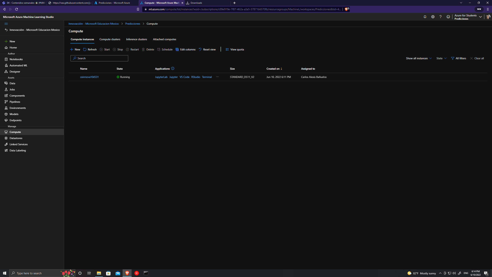
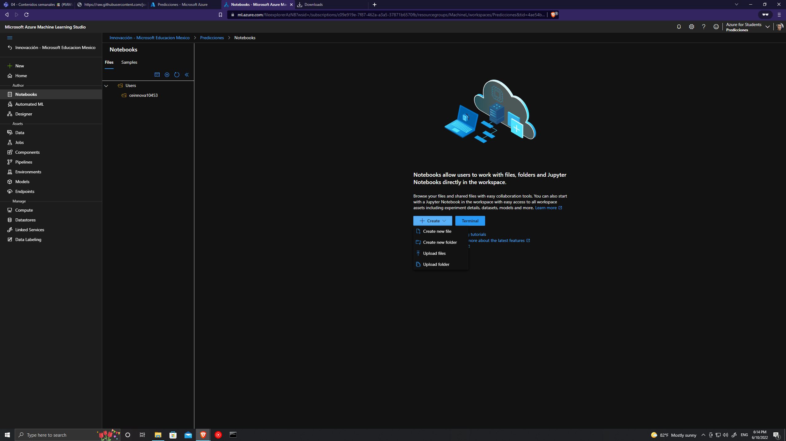
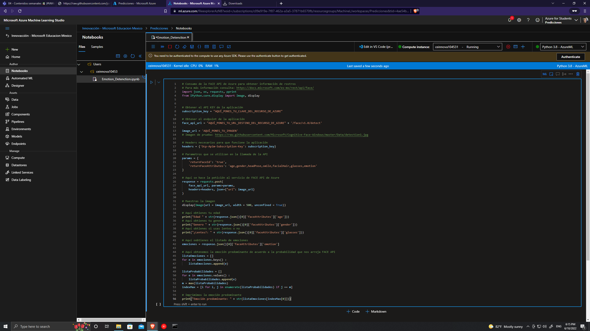
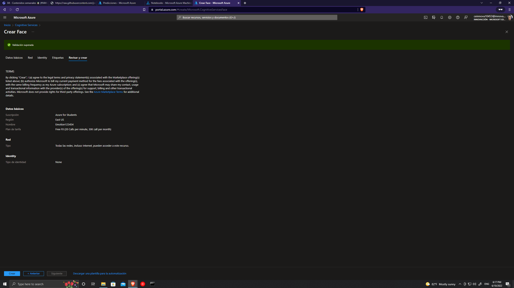
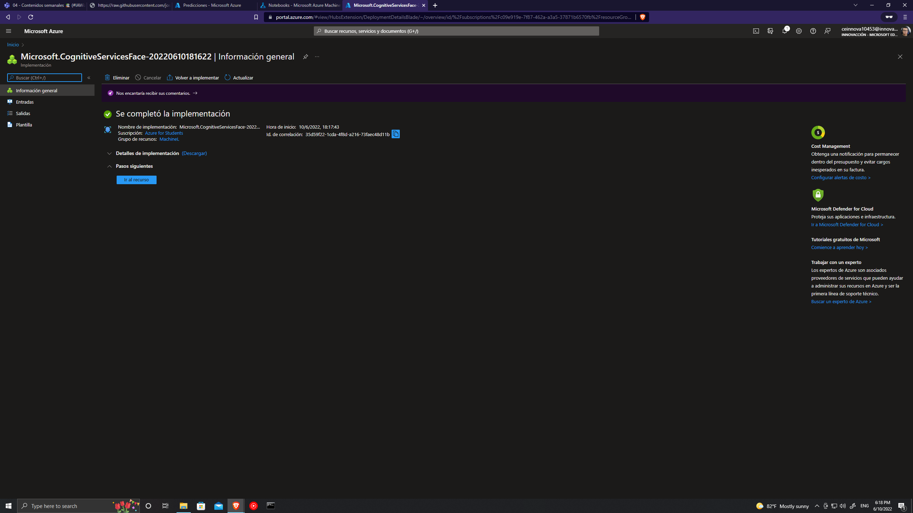
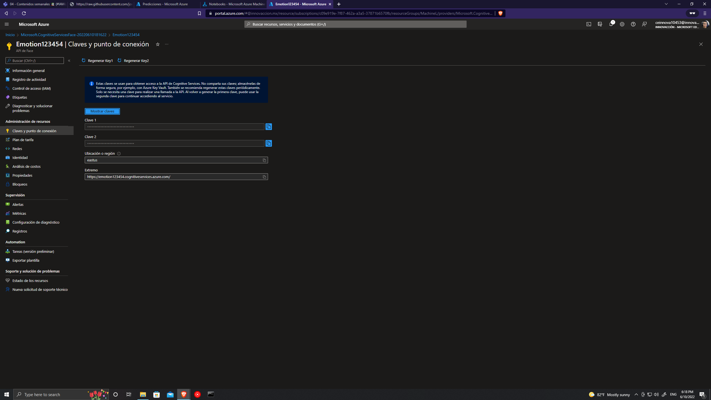

# Face emotion recognition using Azure ML studio y Azure Cognitive Service
First we need to create a resource group and a ML workspace in Azure ML, then in Azure ML we create a compute process the standard cpu VM.
\
\
Now we create a notebook to put our code and consume the API.

\
\
In the python notebook we write our code .

\
\
We need to create a new resource, the Face API, standard cration.
 
\
\
We create it and confirm the resource

\
\
Now we will need to go to keys in Face API

and copy the 1st key and the endpoint, then paste it in the python code.

\
\
Finally we search a picture and paste the url in the code, and run it, and we have the face emotion recognition.

